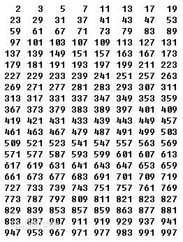

- [原文-“蝉原则”与CSS3随机多背景随机圆角](http://www.zhangxinxu.com/wordpress/2017/02/cicada-principle-css3-randomisation-multiple-backgrounds-border-radius/)

“蝉原则”：以质数作为循环周期来增加“自然随机性”的策略
使用场景：最小成本实现更自然的随机效果

#### [质数](http://baike.baidu.com/view/10626.htm)

质数定义为在大于1的自然数中，除了1和它本身以外不再有其他因数的数称为质数



```javascript
function isPrime(n) {
    if (n <= 3) { return n > 1; }
    if (n % 2 == 0 || n % 3 == 0) { return false; }
 
    for (var  i = 5; i * i <= n; i += 6) {
        if (n % i == 0 || n % (i + 2) == 0) { return false; }
    }
    return true;
}
```
模拟素数

```javascript
2n+1;
3n+2;
5n+3;
7n+5;
11n+7;
13n+11;
```


#### 案例

[随机多背景](http://lea.verou.me/css3patterns/)

<iframe src="//jsfiddle.net/g3uqa4uf/1/embedded/result,css,html"></iframe>  

[CSS3 border-radius随机圆角效果](http://2016.uxlondon.com/speakers)

<iframe src="//jsfiddle.net/yangjl/vpf56m4k/embedded/html,css,result/"></iframe> 

