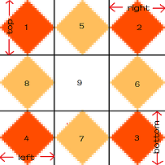

# 阅读笔记


#### [Emoji 简介](http://www.ruanyifeng.com/blog/2017/04/emoji.html)

- Unicode 标准化，分配码点
- 同一码点不同平台的展现不一致
- 插件： nodejs 【[node-emoji](https://www.npmjs.com/package/node-emoji) 】，[css3](https://afeld.github.io/emoji-css/emoji.css)
- 无法书写，只能插入文档
- 零宽度连接符，允许多个码点组合一个Emoji
- 查询平台:[码点查询](http://emojipedia.org/emoji/%F0%9F%98%82/)

```javascript
'😃'.codePointAt(0).toString(16) //转换为Unicode码点
String.fromCharCode('1F603') //需要使用字体
```

#### [为什么你统计 PV 的方式是错的](http://www.jianshu.com/p/84e617daf484#)

- 用户的参与度
- Google Analytics 开通 autotrack,[autotrack开通案例](https://github.com/philipwalton/analyticsjs-boilerplate)


#### [CSS揭秘整理之半透明边框](http://www.jianshu.com/p/d5b16170526c)

- [background-clip](https://developer.mozilla.org/en-US/docs/Web/CSS/background-clip)
    - content-box
    - padding-box
    - text
    - border-box 【default】
- [border](https://developer.mozilla.org/en-US/docs/Web/CSS/border)
- [border-image](https://developer.mozilla.org/en-US/docs/Web/CSS/border-image)
    - border-image-source:none
    - border-image-slice:[ <number> | <percentage> ]{1,4}&& fill?
        - 像素或百分比
        -,
    - border-image-width:1 [ <length> | <percentage> | <number> | auto ]{1,4}
        - e.g. border-image-width: 5% 2em 10% auto;
    - border-image-repeat:stretch
        - stretch:拉伸
        - repeat:平铺
        - round:整数次平铺
    - border-image-outset:[ <length> | <number> ]{1,4} 将边框图片延伸到盒子外面
    - [demo案例](https://jsfiddle.net/yangjl/hovgg0cL/)


#### [用 Git 钩子进行简单自动部署](https://aotu.io/notes/2017/04/10/githooks/)

 - [自定义-Git-Git-钩子](https://git-scm.com/book/zh/v2/%E8%87%AA%E5%AE%9A%E4%B9%89-Git-Git-%E9%92%A9%E5%AD%90)

#### [GPU加速是什么](https://aotu.io/notes/2017/04/11/GPU/)

- GPU提升性能时，需要存储。移动设备内存低，多的 GPU 加速会引起页面卡顿甚至闪退
- 查看的方法 F12 - [more-tools] - Rendering[layerBorders] +layers【查看Memory】 - timeline[]

#### [How to Study: A Brief Guide](http://www.cse.buffalo.edu/~rapaport/howtostudy.html)
- 学习时间安排 30+/week
- 笔记
    - 写纸上
    - 简要重点的，使用缩写，提问题和评论
    - 扩展阅读复习
    - 整理到电脑
- 如何学习书籍
    - 如何高效学习
    - 如何阅读一本书
    - [高效笔记法](http://www.wikihow.com/Take-Cornell-Notes)（康奈尔笔记法）


#### [Debugging Tips and Tricks](https://css-tricks.com/debugging-tips-tricks/?utm_source=javascriptweekly&utm_medium=email) 不推荐

#### padding-top/bottom 和span的关系

- span 设置 padding-top/bottom，实际的高度改变。
- div > span 设置 padding-top/bottom， div实际的高度未改变

```html
<div>
    <span style=" padding: 10px;">Test span padding top bottom</span>
</div>

```

```javascript
div = document.querySelector('div');
div.offsetHeight //21 未改变 和行高有关 ，待举例
```
