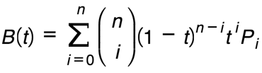

## 八个CSS函数的小技巧

[原文](http://www.w3cplus.com/css/8-clever-tricks-with-css-functions.html)


#### 1、纯CSS Tooltip


```css
.tooltip::after {
    content: attr(data-tooltip);
}

```

#### 6、calc(expression)

规则

- 使用“+”、“-”、“*” 和 “/”四则运算；
- 单位：%,px,em,rem,vh,vw ...
- 单位计算可以混合
- `+`、`-`时，其前后必须要有空格。其他运算可以没有，建议统一
- 需要添加浏览器的前缀

```css

.elm{
    XX:    -moz-calc(expression);/*Firefox*/
    XX:    -webkit-calc(expression);/*chrome、safari*/
    XX:    calc(expression);/*Standard*/
    XX: .../*不支持calc浏览器*/
}
```

#### 贝塞尔曲线

公式 ：

B是一个函数，它接收一个数字的参数t，而且它的值是从0到1，并且其返回的是曲线上的每个点

n代表贝塞尔曲线的程度，其角度越高，曲线形状就越复杂。大多数的时候，二次平方和三次立方是我们所需要的。i是一个整数，从0开始，并且每个循环将增加一次

代表二项式系数。如果我们扩展出二次项，比如(x+y)^n。我们这可以走一个捷径。不管是不是二次项，比如n=3和i=2，都可以快速通过这个组合快速的评估这个表达式

(1-t)... 代表一个多项式中的特定项。PI是其中的一个控制点

[cubic-bezier生成器](http://cubic-bezier.com/)

```css
cubic-bezier(.96,.99,.28,-1.83)
```


参考
[贝塞尔曲线的一些事情](http://www.w3cplus.com/animation/mathematical-intuition-behind-bezier-curves.html)


#### css单位vMin和vMax

- vmin=Math.min(viewport宽,viewport高) *1%;
- vmax=Math.max(viewport宽,viewport高) *1%;
- IE9使用vm代替vmin，且不支持vmax。IE10+支持标准单位。
- [safari bug](https://github.com/rodneyrehm/viewport-units-buggyfill)


####  em缩放的一些使用案例

[原文](http://www.zcfy.cc/article/building-resizeable-components-with-relative-css-units-1276.html)

- 等比例的按钮
- 图片宽／高的成比例缩放
- 成比例变化的边界(box-shadow)
- 给图标留出位置
- 在图片中添加说明文字
- 装饰性背景
- 带icon的搜索框
- 只在需要的时候限制行宽（设置max-width）
- 在列表／警告／模态中定位小图标
- 渐变...


